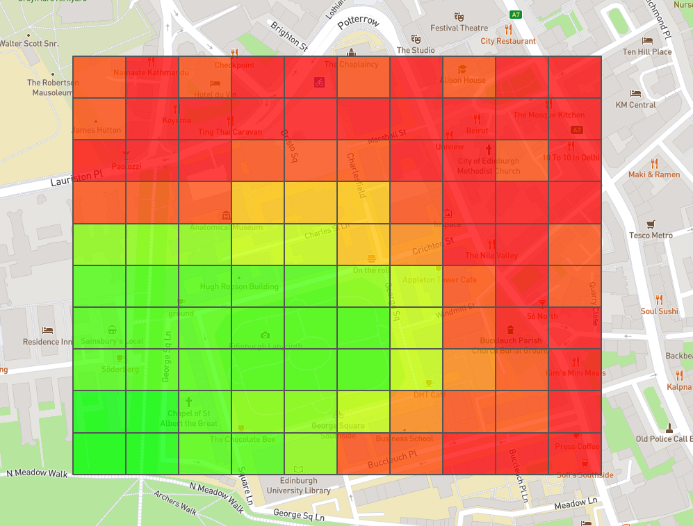

# Informatics Large Practical CW1

This was the first part of the ILP coursework. The task was to create a program that could read a text file and create a geojson heatmap of that data. For this Java 11 was used along with the mapboxsdk for creating the geojson file.

For the predictions.txt file as input the output is in heatmap.geojson and looks like this:

Since the course is now over we were given permission to publish our repositories.
